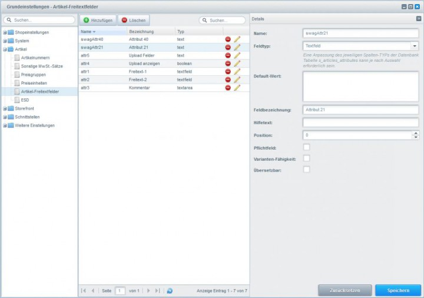

# SwagAdditionalAttributes
> Working with Shopware version 4.0.7 to 5.1.1.
> Higher versions may work either but were not tested.

## Description

Does your shop require several item variants? Are the 20 attribute fields that come standard with Shopware not enough?
No problem! Download this plugin to double your attribute fields to 40, therefore making it possible to meet the complex requirements of your shop.
The additional fields support the same properties as the fields that come with Shopware standard.
Find more information in our [Additional item attribute wiki](http://community.shopware.com/_detail_1197.html?_ga=1.141370866.1528550059.1446819279). 

##images

## License

The MIT License (MIT). Please see [License File](LICENSE) for more information.
